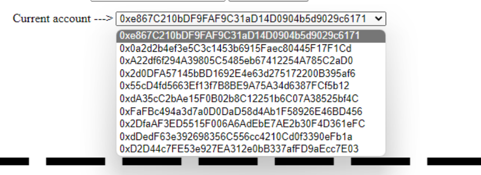
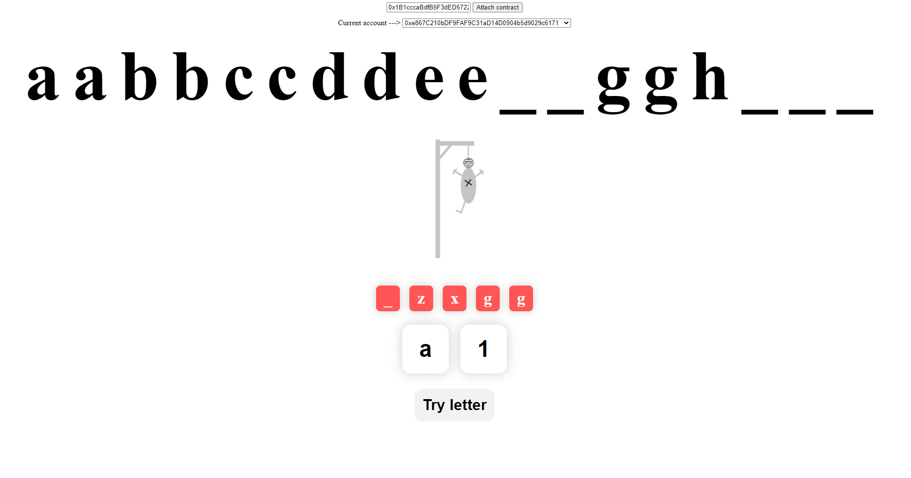
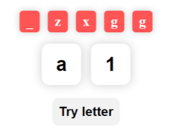

<!-- Do not edit this -->
<style> @import "./md-utils/style.css"; </style>
<script src="./md-utils/jquery.js"></script>
<script src="./md-utils/style.js"></script>

<script type="text/x-mathjax-config">
MathJax.Hub.Config({
    tex2jax: {
        inlineMath: [['$','$'], ['\\(','\\)']],
        skipTags: ['script', 'noscript', 'style', 'textarea', 'pre'] // removed>
    }
});
MathJax.Hub.Queue(function() {
    var all = MathJax.Hub.getAllJax(), i;
    for(i = 0; i < all.length; i += 1) {
        all[i].SourceElement().parentNode.className += ' has-jax';
    }
});
</script>
<script defer
  src="//mathjax.rstudio.com/latest/MathJax.js?config=TeX-MML-AM_CHTML">
</script>
<!-- ---------------- -->


*En fecha 14/01/2023*, por:   
  - *Alberto Carlos Martin Rodriguez*  
  - *Javier Romera Llave*

# Práctica 4 | DII | Blockchain Ethereum: El juego del ahorcado

<div class="img-centered">
  
</div>

<div class="index">

- [Práctica 4 | DII | Blockchain Ethereum: El juego del ahorcado](#práctica-4--dii--blockchain-ethereum-el-juego-del-ahorcado)
- [Descripción general](#descripción-general)
- [Dependencias](#dependencias)
- [Guía de usuario de la aplicación](#guía-de-usuario-de-la-aplicación)
  - [Configurar una instancia propia](#configurar-una-instancia-propia)
  - [Guía de interfaz de usuario](#guía-de-interfaz-de-usuario)
- [Mecánica de juego](#mecánica-de-juego)
- [Descripción del código](#descripción-del-código)
  - [Contrato implementado](#contrato-implementado)
    - [Estructuras](#estructuras)
    - [Eventos](#eventos)
  - [Variables y constantes](#variables-y-constantes)
  - [Métodos](#métodos)
  - [Implementación de la interfaz de usuario](#implementación-de-la-interfaz-de-usuario)
- [Repositorio](#repositorio)
  - [GitLab propietario (recomendado)](#gitlab-propietario-recomendado)
  - [GitHub](#github)
- [Referencias](#referencias)
- [Anexo](#anexo)
  - [Fichero de configuración del ecosistema de ejecución](#fichero-de-configuración-del-ecosistema-de-ejecución)
  - [*Script* de inicialización y desbloqueo de cuentas](#script-de-inicialización-y-desbloqueo-de-cuentas)

</div>

<p break/>

# Descripción general

Hemos decidido implementar una versión modificada del juego del ahorcado para la *blockchain* de *Ethereum*. La mecánica del juego es muy similar a la del ahorcado original pero con algunas modificaciones que mostraremos en la sección [de mecánica de juego](#mecánica-de-juego). Además, también hemos implementado una pequeña y simple interfaz que permite interactuar con el contrato correspondiente y poder así participar en el juego más cómodamente. 

# Dependencias

Dado que ofrecemos una solución con interfaz, la configuración del entorno será ligeramente más compleja que en la práctica anterior, ya que a parte de utilizar *Remix* utilizaremos una instancia de una red privada para la blockchain de *Ethereum* usando el cliente `geth`. También será necesario tener instalado el manejador de paquetes de *Node JS* (`npm`).

- Cómo instalar `npm` -> [https://www.digitalocean.com/community/tutorials/how-to-install-node-js-on-ubuntu-20-04-es](https://www.digitalocean.com/community/tutorials/how-to-install-node-js-on-ubuntu-20-04-es) (recomendamos la segunda opción)

- Cómo instalar `geth` -> [https://geth.ethereum.org/docs/getting-started/installing-geth](https://geth.ethereum.org/docs/getting-started/installing-geth)

> **ATENCIÓN**: estos pasos son necesarios si finalmente decide configurar una instancia propia para probarlo, pero como verá en el siguiente apartado **no es estrictamente necesario**.

# Guía de usuario de la aplicación

Para facilitar la corrección y evitar que el corrector tenga la necesidad de montar y configurar su propia instancia, hemos instanciado una *blokchain* de *Ethereum* propia (*on-premise*) así como un pequeño servidor *HTTP* que sirve la interfaz, para que tan solo sea necesario usar el navegador con `Remix` para crear un contrato nuevo (aunque se dejarán algunas instancias vacías para que se puedan probar sin necesidad de tener que abrir *Remix* ).

> **NOTA**: la interfaz de usuario permite cargar una instancia de un contrato creado anteriormente **pero NO permite crear un contrato**, para crear un contrato será estrictamente necesario el uso de *Remix* usando el proveedor correspondiente (como veremos posteriormente).

A continuación detallamos los pasos necesarios para probar nuestra aplicación de la forma más cómoda posible:

1. Abra su navegador y acceda a la siguiente URL [https://hangman.lromeraj.net](https://hangman.lromeraj.net)

> Antes de comenzar a jugar, le recordamos que hemos implementado un sistema de eventos para dar soporte a cambios en tiempo real que ocurran en el contrato y poder así notificar al resto de jugadores que se encuentren en línea.

2. Como podrá observar en la interfaz de usuario, el primer *input* permite introducir la dirección del contrato correspondiente, a continuación le adjuntamos una serie de instancias con un juego ya creado pero sin interacción previa alguna:
    ``` js
    0x27873B1297894CF18a21b8D63C741e291A1d8D7B "hola" // Máximo 1 participante
    0x2eAa4F76b80999B5e5eAa9f72fdBa4f94E65394A "MrBean" // Máximo 1 participante
    0x8DE0eF8AB6032e13C0F49373912A7a37E3e5bEC4 "BATMAN" // Máximo 1 participante
    0xFeBCd8DbFB28f9617DcedfF9E2A8686F749cB017 "EthereumHangman" // Máximo 2 participantes
    0x1Fd9581e827Ff0b2652739Fca35A26504F83a9A9 "Este es un ejemplo mas largo" // Máximo 4 participantes
    ```
    > **NOTA**: aunque el máximo de participantes sea `1` puede abrir varias ventanas con el mismo contrato y poder ver como (en todas ellas) se actualizan los datos en tiempo real.

3. si desea crear sus propios contratos deberá abrir *Remix* y copiar el código del contrato tal cual se encuentra en el repositorio, se recomienda NO modificar el contrato, ya que esto podría entrar en conflicto con el *ABI* grabado en el servidor *HTTP* que le sirve la interfaz y dejarla inservible (si modifica las cabeceras de algunas funciones por ejemplo). Cuando vaya a desplegar el contrato seleccione el entorno `External Http Provider` y escriba la siguiente URL `https://geth.lromeraj.net`. El siguiente paso simplemente consiste en crear un contrato, ¡piense en un buen secreto a la hora de crearlo! ;)

<p break />

## Configurar una instancia propia

Si por alguna r azón el servicio se encuentra caído, recomendamos esperar unos minutos (puede dar la casualidad ed que estemos dando retoques), o simplemente prefiere instanciar el servicio en su propia máquina, se adjuntan algunas indicaciones adicionales para tal efecto:

1. Eliminar la restricción de `Chrome` sobre redes [privadas que no usan conexiones seguras](https://stackoverflow.com/questions/66534759/cors-error-on-request-to-localhost-dev-server-from-remote-site).
    **IMPORTANTE**: ¡recuerde volver a activarla después de las pruebas!

2. Lanzar el cliente de ejecución local usando la implementación escrita en *Go* de la *blockchain* de *Ethereum* (`geth`):
    ``` bash
    geth \
      --ws \
        --ws.origins="*" \
        --ws.addr="0.0.0.0" \
      --http \
        --http.vhosts="*" \
        --http.corsdomain="*" \
        --http.addr="0.0.0.0" \
        --http.api="web3,eth,personal,net" \
      --allow-insecure-unlock \
      --datadir="data/" \
      --dev \
      --preload="unlock.js" \
      console
    ```
    **ATENCIÓN**: no hace falta que ejecute este comando ahora, es simplemente para que pueda ver algunos de los parámetros que se pasan cuando se ejecute posteriormente de forma automática. El *script* `unlock.js` crea un pequeño conjunto de 10 cuentas, les otorga un balance inicial y desbloquea todas ellas para que puedan ser utilizadas durante las pruebas del juego (la contraseña de todas las cuentas creadas por el script es `1234`). [Ir al anexo para ver el contenido de este *script*](#script-de-inicialización-y-desbloqueo-de-cuentas).
   
    > **IMPORTANTE**: el cliente web de la interfaz de usuario trata de resolver el dominio en función de si utiliza su instancia o la remota, en caso de que surja algún problema recuerde que puede modificar el fichero `index.html` y modificar la *URL* por la siguiente:  
    > ```config
    > ws://localhost:8545
    > ```

3. Ahora debe instalar las dependencias del servidor local *HTTP* ejecutando simplemente:
    ``` bash
    npm install
    ```
4. Ejecute el servidor local *HTTP* junto a la *blockchain* de *Ethereum* con el siguiente comando:
    ``` bash
    npm run start
    ```
    **NOTA**: este comando es un simple *wrapper* que ejecuta un manejador de procesos por debajo:
    ``` js
    pm2 start "ecosystem.config.js"
    ```
    Este fichero contiene todos los parámetros y las indicaciones correspondientes para inicializar todos los procesos necesarios.

5. Abra en su navegador la siguiente URL [http://localhost:5002](http://localhost:5002) ¡y a jugar!

> **ATENCIÓN**: este proyecto incluye claves y configuraciones especiales para un entorno de pruebas y en ningún caso debería usarse para entornos de producción sin una previa limpieza y revisión.

<p break />


## Guía de interfaz de usuario


A continuación detallamos los componentes más importantes de la interfaz de usuario:

- Botón `Attach contract` -> Se usa para conectarse al *address* del contrato que se pone en el *input* que le antecede. 
    <div class="img-centered img-rounded img-shadowed">
      
    </div>
___
- **Selección de cuenta** -> Puede usar el desplegable para seleccionar la cuenta con la que desee participar o realizar la transacción en cuestión.

    <div class="img-centered img-rounded img-shadowed">
      
    </div>
___
- **Imagen del ahorcado** -> Muestra el estado de las vidas restantes del contrato representándolo con el clásico ahorcado.

    <div class="img-centered img-rounded img-shadowed">
      
    </div>


<p break />

- **Entrada del caracter y de la cantidad de letras** -> En estos input se escribe el caracter a adivinar de la palabra y la cantidad de veces que se quiere buscar, valor que implicará un costo de *ether* que se calculará multiplicando la cantidad que se ponga con el precio del caracter especificado en el contrato.

    <div class="img-centered img-rounded img-shadowed">
      
    </div>

- Botón `Try letter` -> Se usará para adivinar si el caracter se encuentra entre los caracteres del secreto (para más información ver la [sección mecánica del juego](#mecánica-de-juego)). 

<p break />

# Mecánica de juego

En esta sección aclararemos los aspectos más importantes relacionados con la mecánica de juego:

- Existe un precio fijo por letra (hemos fijado este valor en `0.1 ether`).
- El creador del contrato (propietario) elige un secreto utilizando caracteres *ASCII* alfanuméricos (también se incluyen los espacios), el coste para formalizar la creación del contrato será en base al número de caracteres que conformen el secreto (en este caso, $C = N * 0.1_{Ether}$).
- El secreto a descubrir puede estar en cualquier lenguaje o formato utilizando los caracteres anteriormente mencionados (no se aplica ningún mecanismo para comprobar si realmente es un texto con "sentido").
- La longitud máxima posible para el secreto será de $36$ letras.

- Dado que el precio gira entorno al número de letras, los participantes cada vez que quieran revelar letras tendrán que pagar en función de las mismas. Uno se convierte en participante con el simple hecho de incorporar alguna letra.
  1. Si la letra solicitada no existe se acumula un reembolso que se devolverá al finalizar.
  2. Si la letra solicitada se ingresa en una cantidad superior a las existentes/restantes se procederá al reembolso cuando finalice el juego.

- Siempre que se finaliza el juego (gane quien gane) lo primero que se hace es reembolsar (en caso de que haya reembolso) el valor correspondiente a cada uno de los participantes.

- En caso de que los participantes hayan agotado todas sus vidas, el propietario recibirá un reembolso íntegro correspondiente al coste total de la creación del contrato, el dinero restante (aportado por los participantes), será distribuido de la siguiente forma:
  - Valor para los participantes -> $V_{Participantes} = D_{Total} * N_{LetrasAcertadas} / N_{LetrasRestantes}$
  - Valor para el propietario -> $V_{Propietario} = D_{Total} - V_{Participantes}$
  - Valor para cada participante -> $V_{Participantes} / N_{Participantes}$  
  **NOTA**: $D_{Total}$ es el depósito total restante tras haber realizado los reembolsos correspondientes.

- En caso de que los participantes resulten ganadores, de nuevo, el primer paso es reembolsar el valor correspondiente a cada uno de ellos, pero en este caso el depósito restante $D_{Total}$ será igual a la suma de la contribución del propietario más todas las contribuciones de los participantes:
  - Valor para cada participante -> $V_{Participante} = D_{total} / N_{Participantes}$

- El propietario NO puede actuar como participante.
- El límite máximo de participantes será de $N_{CaracteresSecreto} / 6$
- Se deduce el número máximo absoluto de participantes por $N_{MaxCaracteres} / N_{MaxParticipantes} = 6$

<p break />

# Descripción del código
Describiremos las partes más relevantes del código implementado para el contrato y la interfaz de usuario correspondiente. 

## Contrato implementado

Empezaremos por las estructuras, eventos y variables utilizadas en el contrato implementado, finalizaremos detallando el funcionamiento de cada uno de los métodos.

### Estructuras

Tan solo hemos hecho uso de una estructura para almacenar la información relacionada con cada uno de los participantes.

``` js
struct Participant {
  uint refund;
  uint index;
}
```

### Eventos

Hemos creado dos eventos para poder notificar a los participantes sobre cambios que van ocurriendo en el juego, principalmente cada vez que se añade un nuevo caracter al contrato y cuando este finaliza:

``` js
event CharsAdded(
    string discoveredChars,
    string incorrectChars,
    uint livesLeft
);

event GameEnded( );
```

## Variables y constantes

``` js
uint256 public constant charPrice = 0.1 ether; // precio por caracter

uint8   private     lives = 6; // número de vidas restantes del contrato
uint    private     maxParticipants; // número máximo de participantes

bytes   private     secret; // secreto del contrato
bytes   private     discoveredChars; // caracteres descubiertos hasta el momento
bytes   private     incorrectChars; // caracteres que no existen en el secreto 

uint    public      charsFound = 0; // número de caracteres encontrados

address public      owner; // propietario del contrato 

address[] public participants; // lista de participantes del contrato

// usamos un pequeño mapa para almacenar información adicional de los participantes
mapping(address => Participant) private participantsMap;
```

<p break />

## Métodos
El constructor del contrato realiza algunas validaciones extra para que la inicialización del juego sea consistente:
``` js
  constructor( 
      string memory __secret 
  ) 
      payable
  {

      secret = bytes( __secret );

      require ( 
          secret.length <= 36,
          "Secret too long, maximum is 36 characters" );

      require ( msg.value == secret.length * charPrice, 
          "You have to pay 0.1 ether per letter" );
      
      for ( uint256 i=0; i < secret.length; i++ ) {
          require( 
              validateAsciiChar( secret[ i ] ),
              "Secret contains invalid characters" );
          discoveredChars.push( "_" );
      }

      owner = msg.sender;
      maxParticipants = secret.length / 6;
      maxParticipants = maxParticipants > 0 ? maxParticipants : 1;
  }
```
___
El siguiente método se encarga de validar si el caracter dado es válido o no (cumple con los requisitos definidos en la [mecánica de juego](#mecánica-de-juego)):

``` js
function validateAsciiChar(
    bytes1 c 
)
    private pure
    returns( bool )
{
    return (c >= 0x30 && c <= 0x39) 
        || (c >= 0x41 && c <= 0x5A)
        || (c >= 0x61 && c <= 0x7A)
        || (c == 0x20);
}
```
___
El siguiente método se encarga de comprobar si el participante dado ya es un participante:
``` js
function isParticipant( 
    address participant 
)
    private view
    returns( bool )
{
    if ( participants.length == 0 ) { 
        return false;
    }
    return participants[ participantsMap[ participant ].index ] == participant;
}
```

<p break />

Para la incorporación de nuevos caracteres al contrato hemos implementado el método `tryChar()`:

``` js
function tryChar( 
    string memory char, 
    uint amount 
) 
    payable public
{
    require ( 
        !gameEnded(), 
        "Game is over!" );
    require( 
        msg.sender != owner,
        "Owner can not participate" );
    require( 
        amount > 0,
        "Amount should be greater than 0" );
    require( 
        msg.value == amount * charPrice, 
        "You have to pay 0.1 ether per letter" );

    if ( !isParticipant( msg.sender ) ) {
        require(
            participants.length < maxParticipants,
            "Game is full" );
        participants.push( msg.sender );
        participantsMap[ msg.sender ].index = participants.length - 1;
    }
    
    uint256 __amount = amount;
    bytes1 byteChar = bytes( char )[ 0 ];

    require( 
        validateAsciiChar( byteChar ),
        "Given char is not valid" );

    for (uint256 i=0; i < secret.length; i++ ) {
        if ( secret[i] == byteChar && discoveredChars[i] != byteChar ) {        
            if ( __amount > 0 ) {
                __amount--;
                charsFound++;
                discoveredChars[ i ] = byteChar;
            } else {
                break;
            }
        }
    }

    if ( amount == __amount ) {
        lives--;
        incorrectChars.push( byteChar );
    }

    participantsMap[ msg.sender ].refund += __amount * charPrice;
    emit CharsAdded( getDiscoveredChars(), getIncorrectChars(), getLivesLeft() );
    if ( gameEnded() ) {
        endGame();
    }
}
```

Como se puede observar realizamos múltiples comprobaciones para garantizar cierta integridad, además es aquí donde hacemos uso del evento que permite notificar a otros participantes de que se han añadido nuevos caracteres. Esto será especialmente útil a la hora de implementar la interfaz.

___

Para comprobar si el juego ha finalizado ya o no, nos basamos únicamente en el número de vidas restantes del contrato o en el número de letras averiguadas hasta el momento:
``` js
function gameEnded()
    public view
    returns ( bool )
{
    return lives == 0 || secret.length == charsFound;
}
```

___

Por otro lado, tememos la siguiente función que nos permite cerrar de forma definitiva el juego y proceder con la devolución de los reembolsos así como el depósito restante para el reparto del premio siguiendo la [mecánica de juego definida anteriormente](#mecánica-de-juego).

``` js
function endGame() 
    private 
{
    
    uint256 jackpot = address( this ).balance;

    for ( uint256 i=0; i < participants.length; i++ ) { // return refund to participants
        address participant = participants[ i ];
        payable( participant ).transfer( participantsMap[ participant ].refund );
    }

    jackpot = address( this ).balance;

    if ( lives > 0 ) { // participants have won
        
        // money is shared between participants
        for ( uint256 i=0; i < participants.length; i++ ) {
            payable( participants[i] ).transfer( jackpot / participants.length );
        }

    } else { // owner has won

        // as the owner can use any ASCII combination (in some situations) it will be very
        // difficult for participants to find out the secret
        // so even thoug the owner has won we don't give the whole jackpot to the owner
        
        uint256 ownerInversion = secret.length * charPrice;
        uint256 sharedJackpot = jackpot - ownerInversion;

        uint256 forParticipants = sharedJackpot * charsFound / secret.length;
        uint256 forOwner = ownerInversion + ( sharedJackpot - forParticipants );

        for ( uint256 i=0; i < participants.length; i++ ) {
            payable( participants[i] ).transfer( forParticipants / participants.length );
        }
        
        payable( owner ).transfer( forOwner );
    }

    emit GameEnded();
}
```

## Implementación de la interfaz de usuario

La interfaz de usuario se reduce a una aplicación web con un cliente de servicio que nos facilita la comunicación con la *blockchain*, es importante que usemos el proveedor de *websockets* para que los eventos funcionen correctamente y los participantes puedan ser notificados en tiempo real. Nos centraremos principalmente en detallar las partes más relevantes de la dinámica de la aplicación *web* definida a través de *JavaScript*.

El directorio local `./public` almacena el contenido estático que será servido por el servidor *HTTP*, en él se encuentran varios ficheros entre los cuales destacamos:

- `abi.js` -> Contiene la estructura de la interfaz binaria de la aplicación.
- `constants.js` -> Algunos parámetros de configuración y constantes.
- `index.html` -> Estructura *HTML* de la aplicación *web* junto a la dinámica más importante.

Nada más cargar la aplicación en el navegador esta se conecta al *endpoint* correspondiente y consulta las distintas cuentas disponibles y las carga en un contenedor seleccionable:
``` js
if ( window.location.hostname === 'hangman.lromeraj.net' ) {
  serviceProvider = new Web3.providers.WebsocketProvider( 'wss://geth-ws.lromeraj.net', WS_OPTIONS )
} else {
  serviceProvider = new Web3.providers.WebsocketProvider( `ws://${ window.location.hostname }:8546`, WS_OPTIONS )
}

const web3 = new Web3( serviceProvider )
const accounts = ( await web3.eth.getAccounts() );
accounts.shift();
accounts.forEach( account => {
  $( '#accounts' ).append( $("<option />", {
    value: account,
    html: account,
  }) )
})
```
___

Cuando el usuario carga la instancia del contrato correspondiente se obtienen los parámetros más importantes del documento, así como el número de vidas restantes, los caracteres descubiertos hasta el momento, etc ... Así mismo, también se registran los dos eventos mencionados anteriormente:

``` js
$( '#attachContract' ).on('click', function() {
  contract = new web3.eth.Contract( ABI, $( '#contractAddress' ).val() );

  contract.methods.charPrice().call({ from: currentAccount }).then( cPrice => {
    charPrice = new BN( cPrice )
  })
  contract.events.CharsAdded({}, (err, evt) => {
    updateDiscoveredChars( evt.returnValues[ 0 ] );
    updateIncorrectChars( evt.returnValues[ 1 ] );
    updateLivesLeft( evt.returnValues[ 2 ] );
  })
  contract.events.GameEnded({}, (err, evt) => {
    alert("Game has ended !");
  })

  pullLivesLeft();  
  pullIncorrectChars();
  pullDiscoveredChars();
})
```

<p break />

Algunas funciones encargadas de actualizar la información del documento *HTML*:
``` js
function updateDiscoveredChars( text ) {
  $("#discoveredChars").html( text )
}

function updateIncorrectChars( text ) {
  $("#incorrectChars").empty();
  $("#incorrectChars").append( 
    text.replace( /\ /g, '_' ).split('')
      .map( c => $('<div />', { class: 'char', html: c }) ) 
  );
}

function updateLivesLeft( livesLeft ) {
  $("#hangmanImage").attr( 'src', `./img/${ 6 - livesLeft + 1 }.jpg` );
}
```
___

Y finalmente, la funcionalidad que permite incorporar una nueva letra al contrato:
``` js
$( '#tryChar' ).on( 'click', function() {
  const char = $('#letter').val()
  const amount = new BN( $('#amount').val() )
  if ( letter ) {
    contract.methods.tryChar( char, amount ).send({ 
      from: currentAccount,
      value: charPrice.mul( amount ),
    }).catch( err => {
      alert( err );
    })
  } else {
    alert('Please, enter only one char')
  }
})
```

<p break />

# Repositorio
A continuación se muestran los repositorios utilizados para la elaboración de este juego.

## GitLab propietario (recomendado)

<div class="img-centered img-rounded">
  
</div>

El siguiente repositorio contiene todo el código fuente de esta práctica -> [https://gitlab.lromeraj.net/lromeraj/ethereum-hangman](https://gitlab.lromeraj.net/lromeraj/ethereum-hangman)


## GitHub

<div class="img-centered img-rounded">
  
</div>

Si el enlace de arriba no le funciona puede utilizar este otro repositorio: [https://github.com/lromeraj/ethereum-hangman](https://github.com/lromeraj/ethereum-hangman)

<p break />

# Referencias

Hemos consultado distintos ejemplos y referencias web para poder conocer las distitnas herramientas y/o librerías que hemos utilizado:

1. Cliente de ejecución para la *blockchain* de *Ethereum* - [https://geth.ethereum.org/docs/fundamentals/node-architecture](https://geth.ethereum.org/docs/fundamentals/node-architecture)

2. Información relacionada con las obtención y envío de datos al *blockchain* usando w3.js [https://web3js.readthedocs.io/en/v1.2.11/web3-eth-contract.html](https://web3js.readthedocs.io/en/v1.2.11/web3-eth-contract.html)

3. Obtención y acceso a la información de las cuentas eth [https://web3js.readthedocs.io/en/v1.2.11/web3-eth-accounts.html#](https://web3js.readthedocs.io/en/v1.2.11/web3-eth-accounts.html#)

4. Otras funcionalidades relacionadas a la configuración, reconexiones, etc [https://web3js.readthedocs.io/en/v1.8.1/web3-eth.html?highlight=WebsocketProvider#configuration](https://web3js.readthedocs.io/en/v1.8.1/web3-eth.html?highlight=WebsocketProvider#configuration)

5. Consulta de aspectos generales sobre la plataforma blockchain Geth [https://geth.ethereum.org/docs](https://geth.ethereum.org/docs)

6. Acceso a las distintas funcionalidades de Geth a traves de comandos [https://geth.ethereum.org/docs/fundamentals/command-line-options](https://geth.ethereum.org/docs/fundamentals/command-line-options)

7. Manipulación y acceso a la información de las cuentas en *Geth* [https://geth.ethereum.org/docs/fundamentals/account-management](https://geth.ethereum.org/docs/fundamentals/account-management)

8. Creación de un fichero de configuración para el despliegue del juego usando pm2 [https://pm2.keymetrics.io/docs/usage/application-declaration/](https://pm2.keymetrics.io/docs/usage/application-declaration/)

<p break />

# Anexo

## Fichero de configuración del ecosistema de ejecución

``` js
module.exports = {
  apps : [{
    name: 'Geth',
    script: 'geth',
    args: [ 
      '--ws', 
        '--ws.origins', "*", 
        '--ws.addr', '0.0.0.0',
      '--http', 
        '--http.vhosts', '*', 
        '--http.corsdomain', '*', 
        '--http.addr', '0.0.0.0', 
        '--http.api', 'web3,eth,personal,net',
      '--allow-insecure-unlock', 
      '--datadir', 'data/',
      '--dev'
    ],
    instances: 1,
    autorestart: true,
    watch: false,
    exec_mode: 'fork',
    max_memory_restart: '1G'
  },
  {
    name: 'Geth (Account unlocker)',
    script: 'geth',
    args: [
      '--datadir', 'data/',
      '--exec', 'loadScript("./unlock.js")',
      'attach'
    ],
    instances: 1,
    watch: false,
    kill_timeout: 500,
    autorestart: true,
    exec_mode: 'fork',
    max_memory_restart: '50M'
  },
	{
    name: 'Http',
    script: 'node',
    args: [ './http.js' ],
    instances: 1,
    autorestart: true,
    watch: false,
    exec_mode: 'fork',
    max_memory_restart: '100M'
  }]
}
```

<p break />

## *Script* de inicialización y desbloqueo de cuentas

``` js
const toWei = web3.toWei;
const BN = web3.BigNumber;
const DEFAULT_ACCOUNT_PASSWORD = "1234";
const DEFAULT_ACCOUNT_BALANCE = toWei( new BN( 100 ), 'ether' );

function createAccounts() {
  if ( eth.accounts.length === 1 ) {
    for ( let i=0; i < 10; i++ ) {
      personal.newAccount( DEFAULT_ACCOUNT_PASSWORD );
    }
  }
} 

function getCurrentAccounts() {
  const currentAccounts = [ ... eth.accounts ]
  currentAccounts.shift();
  return currentAccounts;
}

function unlockAccounts() {
  const accounts = getCurrentAccounts();
  for ( let account of accounts ) {
    let strOut = `Unlocking account ${ account } ... `
    const result = personal.unlockAccount( 
        account, DEFAULT_ACCOUNT_PASSWORD, 0 ); 
    strOut += result ? "OK" : "ERR";
    console.log( strOut )
  }
}

function seedAccounts() {
  const accounts = getCurrentAccounts();
  for ( let account of accounts ) {
    const balanceDiff = DEFAULT_ACCOUNT_BALANCE
      .minus( eth.getBalance( account ) );
    if ( balanceDiff.gt( 0 ) ) {
      console.log(`Sending ${ balanceDiff } ether to ${account} ...`);
      eth.sendTransaction({
        from: eth.accounts[ 0 ],
        to: account,
        value: balanceDiff
      })
    }
  }
}

function main() {
  createAccounts();
  unlockAccounts();
  seedAccounts();
  while ( 1 ) { // this will allow us to keep accounts unlocked
    console.log( "Unlocker heartbeat ..." )
    admin.sleep( 60*60 );
  }
}

main();
```