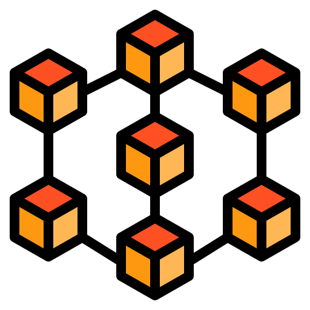

<style>
  @import "./md-utils/style.css";
</style>

*En fecha 08/12/2022*, por:   
  - *Alberto Carlos Martin Rodriguez*  
  - *Javier Romera Llave*

# Práctica 3 | DII | Blockchain

<div class="img-centered">
  
</div>

<div class="index">

- [Práctica 3 | DII | Blockchain](#práctica-3--dii--blockchain)
- [Descripción del código implementado](#descripción-del-código-implementado)
- [Pruebas realizadas (capturas de pantalla)](#pruebas-realizadas-capturas-de-pantalla)
- [Guía de usuario de la aplicación](#guía-de-usuario-de-la-aplicación)
- [Despliegue en la *testnet* de `Goerli`](#despliegue-en-la-testnet-de-goerli)
- [Referencias](#referencias)

</div>

<p break/>

# Descripción del código implementado

En primer lugar tenemos una declaración de las distintas variables que se utilizarán en nuestra aplicación:

``` javascript
address public owner;
address public winner;
uint256 public minParticipants = 2;
uint256 public numberOfParticipants = 0;
uint256 public jackpot = address(this).balance;

address[] private participants;
```

Muchas de estas variables se inicializan en el constructor del contrato:

``` javascript
constructor( uint256 nParticipants ) payable {

    require( 
        nParticipants >= minParticipants,
        "The minimum number of participants is 2" );
    
    owner = msg.sender;
    minParticipants = nParticipants;
}
```

Como se puede observar se obliga a que haya un mínimo de 2 participantes para resolver el sorteo pero el creador del mismo puede exigir un número mayor de participantes. Se utiliza el objeto `msg` para asignar como propietario al creador del contrato.

El creador del sorteo `NO` participa de manera implícita en el mismo, si cualquier usuario desea participar en el sorteo debe utilizar la siguiente función:

``` javascript
function participate() public payable {
    
    jackpot = address( this ).balance;

    require(
        msg.value == 1 wei,
        "You have to pay 1 wei to play the game" );

    for ( uint256 i=0; i < participants.length; i++ ) {
        require(
            participants[i] != msg.sender,
            "You have already applied for this lott" );
    }

    participants.push( msg.sender );
    numberOfParticipants++;
}
```

Dicha función permite a los usuarios participar en el sorteo pagando una cantidad específica de `1 wei`. Como se puede observar se comprueba si el usuario participó anteriormente en este sorteo y evitar que pueda participar varias veces (podría haberse permitido pero en nuestro caso hemos preferido limitarlo y obligar a que todos los participantes tengan la misma probabilidad de obtener el premio).

<p break/>
Una vez que se ha alcanzado el número mínimo de participantes, el propietario del contrato puede resolver el sorteo ejecutando la siguiente función:

``` javascript
function resolve() public {

    require( 
        participants.length >= minParticipants,
        "Not enough participants" );

    require(
        msg.sender == owner,
        "You are not the owner, can not resolve" );
    
    winner = peekRandomParticipant();
    payable( winner ).transfer( jackpot );
    reset();
}
```
Esta función se asegura de que el usuario que solicita la resolución es realmente el propietario, acto seguido se invoca una función encargada de elegir un participante de forma aleatoria de la lista de participantes, como se puede ver a continuación:

``` javascript
function peekRandomParticipant() private view returns( address ) {
    uint256 index = uint256( keccak256( abi.encodePacked( block.timestamp, block.difficulty, participants ) ) ) % participants.length;
    return participants[ index ];
}
```
Esta función utiliza como semilla el instante de la transacción del bloque, la dificultad del mismo, así como los participantes actuales del sorteo (la lista de participantes está oculta). Para implementar esta función nos hemos inspirado en la referencia [[1]](#referencias).

> **NOTA**: utilizar el módulo puede afectar seriamente a la "aleatoridad" de los números generados, ya que es probable que produzca descompensaciones y aparezcan números "viciosos". Debido a que Solidity no tiene soporte nativo para números en coma flotante no es trivial hacer una mejor implementación.

Volviendo a la función `resolve()` tras extraer el participante de manera aleatoria se transfiere todo el lote a dicho participante y se hace un *reset* del juego para volver a sus valores por defecto:

``` javascript
function reset() private {
    delete participants; // limpiamos la lista de participantes
    numberOfParticipants = 0; // reiniciamos el número de participantes
    jackpot = address(this).balance; // actualizamos el valor del lote
}
```

<p break />

# Pruebas realizadas (capturas de pantalla)

Una vez compilada nuestra aplicación (usando el código fuente anteriormente descrito), procederemos a crear un contrato y probar la funcionalidad general de la aplicación.

1. En primer lugar desplegaremos nuestra aplicación:
  
    <div class="img-centered img-rounded img-shadowed" >
      
    </div> 
    Como se puede observar en el mismo botón de desplegar tenemos la opción de elegir el número mínimo de participantes que será necesario para poder resolver el concurso posteriormente.  

    Para esta prueba utilizaremos un mínimo de `3` participantes.

<p break />

2. Tras desplegarlo nos aparecerá lo siguiente:
      
    <div class="img-centered img-rounded img-shadowed" >
      
    </div> 

    Tenemos múltiples botones los cuales nos permitirán ejecutar las distintas funciones que mencionamos anteriormente. Para esta prueba utilizaremos tres usuarios distintos y participaremos con `1` *ether* (aunque en la descripción del código hayamos puesto que era necesario `1` *wei* para las pruebas hemos modificado este valor por `1` *ether* para que los resultados sean más significativos).

    <div class="img-centered img-rounded img-shadowed" >
      
      </br>
      
    </div> 

<p break />


3. Después de haber participado, vemos como el balance ha aumentado acorde a lo ingresado:
    <div class="img-centered img-rounded img-shadowed">
      
    </div> 

    Si intentamos volver a participar con el mismo *addres* (`0x5B38Da6a701c568545dCfcB03FcB875f56beddC4`), obtenemos un error como el que aparece a continuación:

    <div class="img-centered img-rounded img-shadowed" >
      
    </div>

4. Repetiremos los pasos anteriores con los otros dos participantes, el balance total tras esto resulta ser:
    
    <div class="img-centered img-rounded img-shadowed" >
      
    </div>

5. Ahora ya podemos resolver el sorteo, si intentamos resolver el sorteo y no somos el propietario obtendremos un error como el siguiente:

    <div class="img-centered img-rounded img-shadowed" >
      
    </div>

<p break />

6. Si cambiamos a la cuenta del propietario sí que podremos resolver el sorteo, y como podemos observar en la siguiente imagen:
    <div class="img-centered img-rounded img-shadowed" >
      
    </div>

    En este caso es el propio propietario el que ha recibido el premio (ya que también participó voluntariamente).

7. Tras esto, el juego es restablecido y podemos repetir el proceso de participación y resolución mencionado anteriormente.

# Guía de usuario de la aplicación
Dado que en la anterior sección describimos con capturas de pantalla un ejemplo de uso de la aplicación, en este apartado describiremos todas las condiciones y/requisitos de la aplicación:

- El que crea el contrato es considerado como propietario.
- El propietario del contrato es el único que puede solicitar la resolución del sorteo.
- El juego puede ser resulto única y exclusivamente si hay un mínimo de participantes, dicho número de participantes se establece al crear el contrato.
- El propietario no tiene que pagar ni tampoco incluir un depósito inicial para el sorteo.
- Aunque el mínimo de participantes pueda ser establecido por el propietario existe un mínimo absoluto de `2` participantes.
- El propietario también puede participar en el sorteo.
- Solamente se puede participar una única vez en el sorteo, es decir, solo se puede comprar una papeleta por usuario, y cada una de estas papeletas tiene un precio fijo de `1 wei`.
- La resolución del sorteo es pseudoaleatoria, aunque casi aleatoria debido a la espontaneidad de las semillas.


<p break />


# Despliegue en la *testnet* de `Goerli`

Hemos instalado la extensión de `MetaMask` en el navegador y hemos creado `4` cuentas, cada una de ellas con `0.2` *ether* para poder realizar las pruebas con el contrato implementado. Para cargar dichas cuentas hemos utilizado la siguiente web `https://goerlifaucet.com/`.

Utilizando el IDE de Remix podemos desplegar nuestra aplicación en la *testnet* de `Goerli`. Para estas pruebas hemos modificado la participación a `0.01` ether.

1. Seleccionamos `MetaMask` como entorno:
    <div class="img-centered img-rounded img-shadowed" >
      
    </div>

<p break />

2. Tras crear el contrato con la primera cuenta la cantidad de *ether* en esta cuenta se ha reducido por el costo de la transacción:
    <div class="img-centered img-rounded img-shadowed" >
      
    </div>
    
    El contrato resultante tiene la dirección: `0xB6D0eF04e85f2A2249Fa0Dd3E6C74735FDCdF86f`

<p break />


3. Participamos con `0.01` *ether* con las otras tres cuentas, para ello tendremos que insertar el `address` del contrato creado anteriormente:
    <div class="img-centered img-rounded img-shadowed" >
      
    </div>

<p break />

4. A la hora de participar se nos abrirá una nueva pestaña para confirmar la transacción:
    <div class="img-centered img-rounded img-shadowed" >
      
    </div>

<p break />

5. Tras aceptar dicha transacción podemos observar que el contrato tiene el balance correspondiente de `0.1` *ether*:

    <div class="img-centered img-rounded img-shadowed" >
      
    </div>

    Tras realizar las dos participaciones restantes con las otras cuentas podemos observar que le contrato tiene un balance total de `0.3` *ether*:

    <div class="img-centered img-rounded img-shadowed" >
      
    </div>

6. Si volvemos a seleccionar la cuenta propietaria del contrato podemos proceder a resolver el sorteo y observamos el dinero que tenían cada una de las cuentas justo antes y después de resolver dicho sorteo:
    | Address | Antes | Después |
    |--|--|--|
    | Account1 | 0.2362 | 0.2361 |
    | Javichu1 | 0.1797 | 0.1797 |
    | Javichu2 | 0.1598 | 0.1898 |
    | Javichu3 | 0.1697 | 0.1697 |

    La cuenta `Account1` que es la cuenta que gestiona el sorteo tiene menos dinero debido a la transacción que tuvo que pagar para resolver el sorteo. Y como podemos observar el ganador en este caso fue `Javichu2` que recibió los `0.3` *ether* (algo menos por el costo de esta última transacción).

<p break />

# Referencias

Hemos consultado distintos ejemplos y referencias web para poder conocer los objetos y derivados de Selenium para implementar toda la funcionalidad de la aplicación *Blockchain*:

1. Randomness in solidity - [https://codedamn.com/news/solidity/generate-a-random-number](https://codedamn.com/news/solidity/generate-a-random-number)


