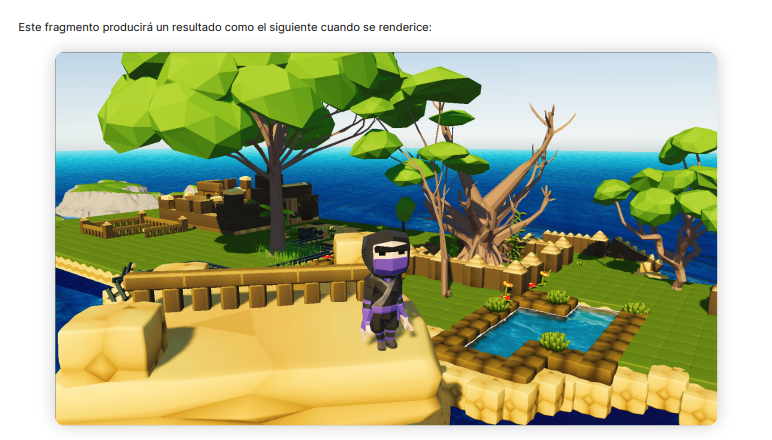

<!-- Do not edit this -->
<style> @import url("./style.css"); </style>
<script src="./jquery.js"></script>
<script src="./style.js"></script>
<!-- ---------------- -->

*En fecha 06/10/2022*, por:   
  - *Alberto Carlos Martin Rodriguez*  
  - *Miguel Ángel Martínez López*
  - *Paola Ronquillo Cajamarca*
  - *Javier Romera Llave*

# Práctica `<Número práctica>` | `<Nombre asignatura>` | `<Título práctica>`

<div class="img-centered">
  
</div>

- [Práctica `<Número práctica>` | `<Nombre asignatura>` | `<Título práctica>`](#práctica-número-práctica--nombre-asignatura--título-práctica)
  - [Requisitos](#requisitos)
  - [Cómo generar la tabla de contenidos](#cómo-generar-la-tabla-de-contenidos)
  - [Cómo añadir imágenes](#cómo-añadir-imágenes)
  - [Cómo añadir saltos de página](#cómo-añadir-saltos-de-página)
  - [Dónde guardar las imágenes](#dónde-guardar-las-imágenes)
  - [Cómo previsualizar durante la redacción](#cómo-previsualizar-durante-la-redacción)
  - [Cómo generar el PDF final](#cómo-generar-el-pdf-final)
  - [Información de interés general](#información-de-interés-general)

<p break />

## Requisitos
- Para poder trabajar cómodamente con markdown en *Visual Studio Code* se recomienda [instalar la siguiente extensión](https://marketplace.visualstudio.com/items?itemName=yzhang.markdown-all-in-one).

- Para que los estilos y etiquetas mencionadas en este documento funcionen es necesario incluir en la cabecera del `Markdown` el fichero `style.css`:
  ``` html
  <link rel="stylesheet" href="./style.css" />
  ```

- Para [generar los PDFs](#cómo-generar-el-pdf-final) se recomienda utilizar un paquete de `Node JS` denominado `md-to-pdf` que podéis encontrar [en el siguiente enlace](https://www.npmjs.com/package/md-to-pdf) (recordar que es necesario tener instalado el entorno de `Node JS`). A continuación se adjunta una pequeña guía para la instalación del paquete (no de `Node JS`, para instalar el entorno de Node en el ordenador consultar Google):
  1. Una vez `npm` sea un comando accesible, ejecutar:
      ``` bash
      npm i -g md-to-pdf
      ``` 
  2. Para poder acceder a los ejecutables que instaláis de manera global con `npm` debéis añadir al `PATH` el directorio: `~/node_modules/bin/` (comúnmente el fichero `$HOME/.bashrc` suele ser utilizado para configurar las variables de entorno por defecto). 

## Cómo generar la tabla de contenidos
La tabla de contenidos que se puede apreciar en la portada se genera de **manera totalmente automática**, es necesario tener instalada la extensión mencionada en los requisitos para que funcione de manera automática, para crear una nueva (en caso de que no exista):
  1. Pulsar `Ctrl+Shift+P`
  2. Ejecutar el comando `Markdown All In One: Create Table of Contents`
  3. Listo!

## Cómo añadir imágenes
Hay varias formas de añadir imágenes en un documento `Markdown`, pero para poder aprovechar la hoja de estilos personalizada para las prácticas lo mejor es utilizar etiquetas `HTML` normal y corrientes como por ejemplo:

``` html
<div class="img-centered img-shadowed img-rounded">
  
</div>
```

Este fragmento producirá un resultado como el siguiente cuando se renderice:

<div class="img-centered img-shadowed img-rounded">
  
</div>

## Cómo añadir saltos de página
Para añadir saltos de página es necesario añadir la siguiente división:

``` html
<p break />
```

## Dónde guardar las imágenes
Para procurar que las prácticas sean coherentes entre sí, se recomienda usar siempre en el directorio raíz del repositorio una carpeta llamada `./img/` donde se guardarán todas las imágenes que se consideren oportunas para redactar las memorias. Usar este repositorio como ejemplo para hacer las pruebas.

## Cómo previsualizar durante la redacción
Si mientras redactas el fichero en formato `markdown` deses previsualizar los cambios puedes utilizar la siguiente combinación de teclas para abrir la previsualización: `Ctrl+Shift+V`, se abrirá una pestaña nueva en el `Visual Studio Code` donde podrás ver los cambios en tiempo real.

## Cómo generar el PDF final
Para conseguir el mejor resultado es necesario generar primero la versión en formato `html` del `Markdown`, es decir:
  1. Generar la versión en formato `.html`, usando:
      ``` bash
      md-to-pdf README.md --as-html
      ```
  2. Abrir con el navegador el fichero `README.html` generado:
      ``` bash
      google-chrome README.html
      ```
  3. En el navegador presionar con el click derecho del ratón en cualquier lado y pulsar sobre `Imprimir`, en la ventana que se abra le daís a guardar como PDF y os aseguráis de que el documento se visualiza correctamente.
  
  4. Finalmente guardar el PDF en la carpeta raíz del repositorio. 

En este repositorio tenéis el `PDF` generado (`README.pdf`) equivalente de este fichero `README.md`.

## Información de interés general
- Este repositorio será incluido como un submódulo en cada uno de los repositorios de las prácticas, de esta forma el fichero de estilo se podrá actualizar y poder así replicar dichos cambios al resto de prácticas. Para añadir este repositorio como sub-módulo de otros repositorios ejecutar el siguiente comando en la carpeta raíz del repositorio:  
  ``` bash
  git submodule add git@gitlab.lromeraj.net:ucm/miot/md-utils.git
  ```

- Si queremos añadir notas para indicar que queda pendietne trabajo por hacer, usar:
  ``` html
  <todo>Esto está pendiente de hacer ...</todo>
  ```

<todo>Este mensaje es un ejemplo de que queda por hacer algo, y no debería aparecer ninguno así en la entrega.</todo>

